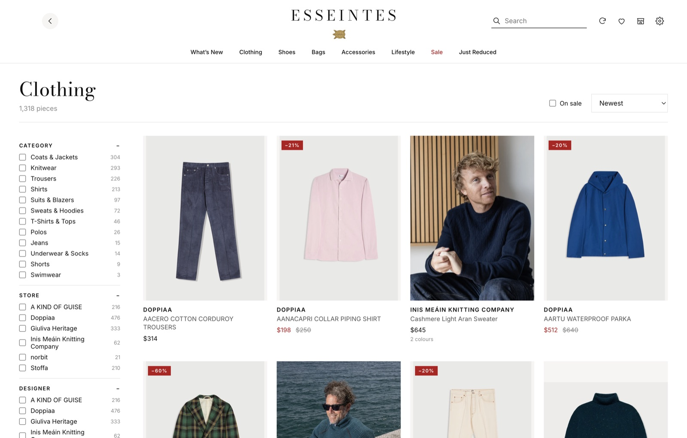
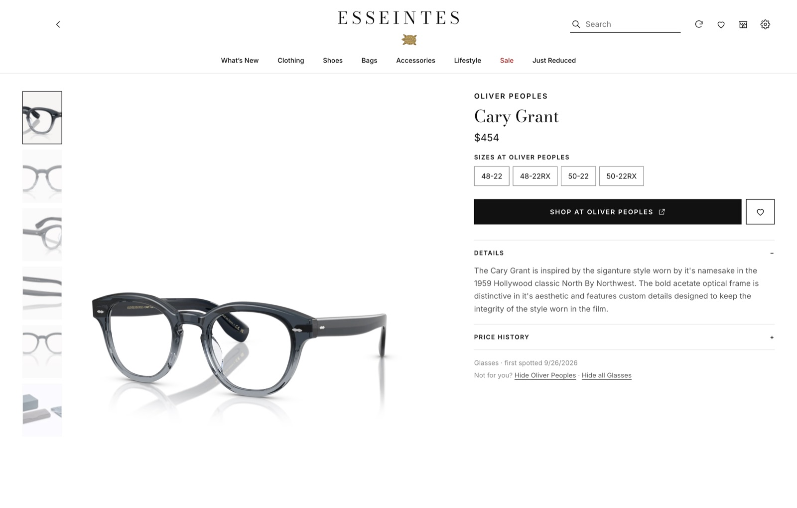

# Esseintes


A desktop stockist for the online stores you actually shop. Add any store's web address and Esseintes pulls in everything it sells (photos, descriptions, sizes, prices) into one place with a clean, editorial storefront. It refreshes every time you open it, so you see new arrivals, price drops, sold-out sizes and store-wide sales without visiting each site.

Nothing is hard-coded: stores, department (menswear / womenswear / both), currency and sizes are all yours to choose.



## Features

- **One catalogue for all your stores.** Browse by department and category (shirts, knitwear, coats, shoes, sunglasses, hats…), store, designer, size and price, or search across everything.
- **Only your department.** Pick menswear, womenswear or both once. Esseintes uses each store's own men's and women's collections to decide what to collect, and ignores the rest, including kids' lines.
- **In English.** Stores that publish an English version of their catalogue are read in English; other descriptions get a one-click link to a translated page.
- **One currency.** Prices are converted to your currency (USD by default) at daily rates, with the store's own price shown alongside.
- **Every colourway, one card.** Whether a store lists colours as options or as separate products, each model gets one card, and its product page cycles through every colourway with that colour's own photos, sizes and stock. A newly added colour shows up in What's New on its own.
- **Always current.** Every launch (and optionally every few hours while open) re-reads each store: new items are added, sold-out items disappear, prices and sizes update, and items a store removes are retired.
- **New in and just reduced.** The home page leads with arrivals since your last visit and recent markdowns (5% or more, so a store's automatic currency rounding doesn't count). Every product keeps a price history.
- **Store-wide sales.** Announcement banners on each store's homepage are scanned for offers like "Extra 20% off everything with code FALL20". Sitewide offers are shown on every product from that store, with an estimated final price. You can also add or dismiss sales by hand.
- **Your sizes.** Save the sizes you wear; they're highlighted on product pages, and you can hide anything that isn't in stock in your size.
- **The Collection.** Save pieces with the size you want (even when it's sold out), filter to what's available in your size, and get a notification when a saved piece drops in price or your size comes back.
- **Hide what you don't want.** Hide a designer or a whole category from any product page, and manage the lists in Settings.
- **Bring your list.** Paste several store addresses at once, or import a `.txt`/`.csv`/`.json` list. Export your stores to JSON to back them up or share them.
- **Wishlist**, infinite scroll, and links straight to the product on the store's own site.



## How stores are read

| Store type | How | Notes |
| --- | --- | --- |
| **Shopify** (most independent brands) | Public `/products.json` feed | Complete, fast and exact: per-size stock, sale prices, all images. |
| **WooCommerce** | Public Store API (`/wp-json/wc/store/v1/products`) | Complete; size stock is per product rather than per size. |
| **Anything else** | Sitemap + the schema.org product data shops publish for search engines | Slower, capped at 800 products per sync, and depends on the site. |

The platform is detected automatically when you add a store. Large department stores and marketplaces often block automated access, and those may not work.

Esseintes only reads publicly listed product data, at a gentle pace. Prices and stock are always confirmed on the store's own site when you click through.

## Getting started

Requires [Node.js](https://nodejs.org) 22 or newer.

```bash
npm install
npm run dev        # run in development with hot reload
```

To build a standalone app (macOS `.dmg`, Windows installer, or Linux AppImage, depending on your OS):

```bash
npm run dist       # output goes to release/
```

Builds are unsigned, so on macOS right-click the app and choose **Open** the first time.

Your data lives in a single SQLite file in the app's data folder (`~/Library/Application Support/esseintes/esseintes.db` on macOS). Delete it to start fresh.

## Development

```
src/
  main/            Electron main process
    adapters/      shopify.ts, woocommerce.ts, generic.ts: one per store platform
    classify.ts    category / gender / size rules
    promotions.ts  store-wide sale detection from homepage banners
    currency.ts    exchange rates (open.er-api.com, refreshed twice a day)
    alerts.ts      wishlist price-drop / back-in-stock rules
    storelist.ts   parsing imported store lists
    sync.ts        fetch → classify → diff against the database
    db.ts          SQLite schema and queries (Node's built-in node:sqlite, no native modules)
  preload/         the typed bridge exposed to the UI as window.api
  renderer/        React UI
  shared/types.ts  types shared across processes
```

Useful commands:

```bash
npm run typecheck
npm run smoke -- store-one.com store-two.com   # headless sync into a throwaway DB, prints what was found
```

`smoke` is the quickest way to try a new store or work on an adapter: it prints category, size and gender breakdowns, sample products and detected sales.

### Adding a platform

Implement the `Adapter` interface in `src/main/adapters/types.ts` (`detect` and `fetchAll` returning `RawProduct`s) and add it to the list in `src/main/sync.ts`, ahead of the generic fallback.

## License

GNU General Public License v3.0. See [LICENSE](LICENSE).
